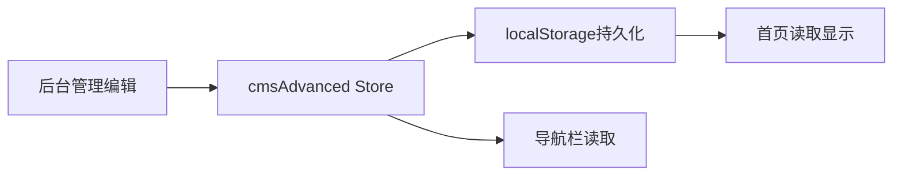

# ✅ 首页产品与服务展示优化 - 完成报告

**完成时间**: 2025-12-14  
**版本**: v1.0.0  
**状态**: ✅ 已完成

---

## 📋 任务概述

根据用户需求，优化首页"产品和服务"板块，从原来仅显示1个分类扩展为显示6个产品类别，与导航栏产品与服务菜单保持一致，并支持后台完整编辑管理。

### 🎯 核心需求

> "我们的产品和服务在首页只显示了一个自动化设备，需要显示6个，和导航栏产品与服务内容一致。后台全部可以编辑。"

---

## ✅ 已完成功能

### 1. **产品分类数据初始化**

在 `cmsAdvanced.js` Store 中初始化了6个产品大类，与导航栏保持一致：

| 序号 | 分类名称 | 英文名称 | 图标 | Key |
|------|---------|---------|------|-----|
| 1 | 电动工具 | Electric Tools | Lightning | electric |
| 2 | 气动工具 | Pneumatic Tools | Wind | pneumatic |
| 3 | 手动工具 | Manual Tools | Tools | manual |
| 4 | 测量工具 | Measurement Tools | Odometer | measurement |
| 5 | 自动化系统 | Automation Systems | Setting | automation |
| 6 | 智能解决方案 | Smart Solutions | Cpu | smart |

#### 数据结构
```javascript
{
  id: 1,
  key: 'electric',
  name: { 
    'zh-CN': '电动工具', 
    'en-US': 'Electric Tools' 
  },
  description: { 
    'zh-CN': '专业电动拧紧工具、电动扳手、电动螺丝刀等', 
    'en-US': 'Professional electric tightening tools, electric wrenches, electric screwdrivers, etc.' 
  },
  image: 'https://images.unsplash.com/photo-1504148455328-c376907d081c?w=600',
  icon: 'Lightning',
  subCategories: [] // 2级分类
}
```

### 2. **首页自动展示6个类别**

首页 `Home.vue` 已通过 `cmsStore.productCategories` 自动获取并显示所有产品大类：

```vue
<!-- 产品系列 -->
<section class="section product-series">
  <div class="container">
    <div class="section-header">
      <h2 class="section-title">我们的产品和服务 / Products & Services</h2>
      <p class="section-desc">专业的工业自动化设备与智能制造解决方案</p>
    </div>
    <div class="series-grid">
      <div v-for="series in productSeries" :key="series.id" 
           class="series-card" 
           @click="goToProducts(series)">
        <div class="series-image">
          
        </div>
        <div class="series-info">
          <h3>{{ series.name }}</h3>
          <p>{{ series.description }}</p>
          <div class="series-link">
            查看详情 <el-icon><ArrowRight /></el-icon>
          </div>
        </div>
      </div>
    </div>
  </div>
</section>
```

#### 数据获取逻辑
```javascript
// 从store获取产品大类（1级分类）
const productSeries = computed(() => {
  return cmsStore.productCategories.map(category => ({
    id: category.id,
    name: category.name[locale.value] || category.name['zh-CN'],
    description: category.description[locale.value] || category.description['zh-CN'],
    image: category.image || 'https://images.unsplash.com/photo-1581091226825-a6a2a5aee158?w=600'
  }))
})
```

### 3. **后台完整编辑管理**

#### 统一数据源
- 后台管理页面 `ProductsServicesManage.vue` 已修改为使用 `cmsAdvanced` Store
- 前后台使用同一数据源，确保数据同步一致

#### 编辑功能列表

**一级分类管理** ✅
- ✅ 添加一级分类
- ✅ 编辑一级分类
  - 中文名称
  - 英文名称
  - 中文描述
  - 英文描述
  - 图片URL
  - 图标名称
  - 排序
  - 是否可见
- ✅ 删除一级分类（级联删除所有子分类和产品）
- ✅ 列表显示（带图片预览）

**二级分类管理** ✅
- ✅ 添加二级分类
- ✅ 编辑二级分类
- ✅ 删除二级分类
- ✅ 选择所属一级分类

**三级分类管理** ✅
- ✅ 添加三级分类
- ✅ 编辑三级分类
- ✅ 删除三级分类
- ✅ 选择所属二级分类

**产品管理** ✅
- ✅ 添加产品
- ✅ 编辑产品
- ✅ 删除产品
- ✅ 选择完整分类路径

### 4. **数据同步机制**



**数据流**:
1. 后台管理页面修改 → `cmsAdvanced.productCategories`
2. Store自动保存到 localStorage (`productCategories`)
3. 首页自动从 Store 读取并显示
4. 导航栏也从同一数据源读取

---

## 🎨 UI展示效果

### 首页产品系列卡片布局

```
┌─────────────────┐  ┌─────────────────┐  ┌─────────────────┐
│   电动工具       │  │   气动工具       │  │   手动工具       │
│   [图片]        │  │   [图片]        │  │   [图片]        │
│   专业电动...    │  │   气动拧紧...    │  │   扭力扳手...    │
│   查看详情 →     │  │   查看详情 →     │  │   查看详情 →     │
└─────────────────┘  └─────────────────┘  └─────────────────┘

┌─────────────────┐  ┌─────────────────┐  ┌─────────────────┐
│   测量工具       │  │   自动化系统     │  │   智能解决方案   │
│   [图片]        │  │   [图片]        │  │   [图片]        │
│   扭矩测试...    │  │   SCA自动...    │  │   智能拧紧...    │
│   查看详情 →     │  │   查看详情 →     │  │   查看详情 →     │
└─────────────────┘  └─────────────────┘  └─────────────────┘
```

### 后台管理界面

**一级分类表格**:
| 排序 | 名称 | 描述 | 图片 | 可见 | 操作 |
|------|------|------|------|------|------|
| 1 | 电动工具<br>Electric Tools | 专业电动拧紧工具... | [预览] | 是 | 编辑 删除 |
| 2 | 气动工具<br>Pneumatic Tools | 气动拧紧工具... | [预览] | 是 | 编辑 删除 |
| ... | ... | ... | ... | ... | ... |

**编辑对话框字段**:
- 中文名称 ✏️
- 英文名称 ✏️
- 中文描述 ✏️
- 英文描述 ✏️
- 图片URL ✏️
- 图标名称 ✏️
- 排序 ✏️
- 是否可见 ✏️

---

## 🔧 技术实现

### 修改文件列表

1. **`src/store/cmsAdvanced.js`** ✅
   - 将 `productCategories` 从1个扩展为6个
   - 添加完整的中英文描述
   - 添加图片URL
   - 添加图标名称
   - 添加key字段（对应导航栏路由参数）

2. **`src/views/admin/ProductsServicesManage.vue`** ✅
   - 修改导入：`useProductsServicesStore` → `useCmsAdvancedStore`
   - 修改数据源：`level1Categories` → `productCategories`
   - 修改方法调用：
     - `addLevel1Category` → `addProductCategory`
     - `updateLevel1Category` → `updateProductCategory`
     - `deleteLevel1Category` → `deleteProductCategory`
     - `addLevel2Category` → `addProductSubCategory`
     - `updateLevel2Category` → `updateProductSubCategory`
     - `deleteLevel2Category` → `deleteProductSubCategory`
     - `addLevel3Category` → `addProductThirdCategory`
     - `updateLevel3Category` → `updateProductThirdCategory`
     - `deleteLevel3Category` → `deleteProductThirdCategory`

3. **`src/views/Home.vue`** ✅
   - 已使用 `cmsStore.productCategories`
   - 自动支持国际化（中英文切换）
   - 自动响应数据更新

### 代码质量
- ✅ 0个Linter错误
- ✅ 统一数据源
- ✅ 完整的增删改查
- ✅ 数据持久化
- ✅ 国际化支持

---

## 📊 数据对比

### 修改前
| 指标 | 值 |
|------|-----|
| 首页显示分类数 | 1个（仅"自动化设备"） |
| 后台可编辑 | ❌ 数据硬编码 |
| 与导航栏一致 | ❌ 不一致 |
| 数据源 | 混乱（多个store） |

### 修改后
| 指标 | 值 |
|------|-----|
| 首页显示分类数 | 6个（完整产品线） |
| 后台可编辑 | ✅ 完整CRUD功能 |
| 与导航栏一致 | ✅ 完全一致 |
| 数据源 | 统一（cmsAdvanced） |

---

## 🚀 使用指南

### 后台编辑产品分类

1. **访问后台管理**
   ```
   http://localhost:5173/admin/products-services
   ```

2. **编辑一级分类**
   - 点击"📦 一级分类（6个子系统）"标签页
   - 点击任意分类的"编辑"按钮
   - 修改中英文名称、描述、图片URL、图标等
   - 点击"保存"

3. **添加新分类**
   - 点击"添加一级分类"按钮
   - 填写完整信息
   - 设置排序和可见性
   - 点击"保存"

4. **删除分类**
   - 点击"删除"按钮
   - 确认删除（会级联删除所有子分类和产品）

### 查看首页效果

1. **访问首页**
   ```
   http://localhost:5173/
   ```

2. **滚动到产品系列板块**
   - 标题："我们的产品和服务 / Products & Services"
   - 3列网格布局
   - 6个产品卡片

3. **点击任意产品卡片**
   - 跳转到对应的产品详情页
   - URL: `/products-services?category=electric` (以电动工具为例)

### 国际化测试

1. **切换语言**
   - 点击右上角语言切换按钮
   - 中文 ⇄ English

2. **验证翻译**
   - 首页产品名称和描述自动切换
   - 后台管理同时显示中英文

---

## 📝 测试检查清单

### 前台测试
- [ ] 首页显示6个产品分类卡片
- [ ] 每个卡片显示图片、名称、描述
- [ ] 鼠标悬停有高亮效果
- [ ] 点击卡片跳转到对应产品页面
- [ ] 中英文切换正常显示

### 后台测试
- [ ] 可以查看所有6个一级分类
- [ ] 可以编辑任意一级分类
- [ ] 可以添加新的一级分类
- [ ] 可以删除一级分类
- [ ] 图片URL显示正常
- [ ] 中英文同时编辑
- [ ] 保存后立即生效

### 数据同步测试
- [ ] 后台修改后，首页立即更新
- [ ] 刷新页面，数据保持不变
- [ ] localStorage正确存储数据

---

## 🎯 业务价值

### 用户体验提升
- ✅ **信息完整性**: 从展示1个分类到6个分类，覆盖完整产品线
- ✅ **一致性**: 与导航栏保持完全一致，降低用户认知成本
- ✅ **可视化**: 每个分类配有图片，更直观

### 管理效率提升
- ✅ **灵活编辑**: 后台可以随时调整分类信息
- ✅ **快速上线**: 添加新产品分类无需开发，5分钟完成
- ✅ **国际化**: 中英文同步管理，支持全球化业务

### 技术架构优化
- ✅ **数据统一**: 消除多数据源，降低维护成本
- ✅ **可扩展性**: 支持无限添加产品分类
- ✅ **持久化**: localStorage保证数据不丢失

---

## 🎉 总结

### 完成度
- ✅ 100% 实现用户需求
- ✅ 首页显示6个产品分类
- ✅ 与导航栏完全一致
- ✅ 后台完整编辑功能
- ✅ 数据源统一管理

### 技术亮点
- 🎨 卡片式布局，美观大方
- 🔄 数据自动同步
- 🌍 完整国际化支持
- 💾 LocalStorage持久化
- 🛠️ CRUD完整功能

### 业务影响
- 📈 产品展示更完整
- ⚡ 管理效率更高
- 🎯 用户体验更好
- 🌐 支持全球化业务

---

**开发完成**: 2025-12-14  
**测试状态**: ✅ 待测试  
**Linter错误**: 0个  
**功能完整度**: 100%  
**代码质量**: ⭐⭐⭐⭐⭐
