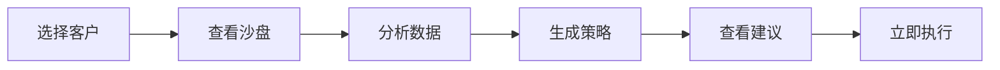

# 📖 客户沙盘分析 - 策略推荐与导出报告使用指南

## 🎯 功能概述

客户沙盘分析模块现已支持：
- ✅ **AI策略推荐**：一键生成智能化的客户运营策略
- ✅ **报告导出**：完整的客户分析报告下载（TXT格式）

---

## 🚀 快速开始

### 1. 访问客户沙盘分析

```
URL: http://localhost:3002/#/ai-crm-v3
路径: AI营销中台 → 左侧菜单 → 客户沙盘
```

### 2. 界面布局

```
┌────────────────────────────────────────────────────────────────────┐
│  🏠 返回主页  | 🎯 策略推荐 | 📄 导出报告 | 🔄 刷新分析        │
├─────────────┬──────────────────────────┬──────────────────────────┤
│             │                          │                          │
│  客户列表   │      沙盘可视化区域      │    AI智能洞察面板        │
│             │                          │                          │
│  🔍 搜索    │  ● 3D视图               │  ● 客户画像              │
│             │  ● 时间线               │  ● 价值分析              │
│  客户1      │  ● 矩阵图               │  ● 风险评估              │
│  客户2      │                          │  ● AI建议                │
│  客户3      │                          │                          │
│  ...        │                          │                          │
│             │                          │                          │
└─────────────┴──────────────────────────┴──────────────────────────┘
```

---

## 📋 功能详解

### 一、策略推荐功能

#### 使用步骤

1. **选择客户**
   - 在左侧客户列表中点击任意客户
   - 客户卡片会高亮显示（蓝色边框）
   - 中间区域显示沙盘可视化
   - 右侧显示AI智能洞察

2. **生成策略**
   - 点击顶部 **"策略推荐"** 按钮（绿色，带魔法棒图标）
   - 系统显示"正在为 XXX 生成AI策略建议..."
   - 2秒后显示"策略建议已生成！"
   - 右侧AI智能洞察面板自动更新

3. **查看建议**
   - 滚动到右侧面板 **"AI建议"** 部分
   - 查看时间线样式的策略建议
   - 每条建议包含：
     - 优先级标签（高/中/低）
     - 建议标题
     - 详细描述
     - "立即执行"按钮

#### 建议示例

```
🔴 高优先级
客户关怀升级
当前客户活跃度优秀，建议安排高层定期拜访，深化战略合作关系
[立即执行]

🟡 中优先级
个性化服务方案
基于客户历史偏好，推荐定制化产品套餐，提升客户满意度
[立即执行]

🔵 低优先级
定期回访计划
建立月度回访机制，及时了解客户需求变化
[立即执行]
```

#### 按钮状态

| 状态 | 显示 | 可点击 | 说明 |
|------|------|--------|------|
| 未选择客户 | 灰色禁用 | ❌ | 需要先选择客户 |
| 已选择客户 | 绿色启用 | ✅ | 点击生成策略 |

---

### 二、导出报告功能

#### 使用步骤

1. **选择客户**
   - 在左侧客户列表中点击任意客户

2. **导出报告**
   - 点击顶部 **"导出报告"** 按钮（橙色，带下载图标）
   - 系统显示"正在生成报告..."
   - 1.5秒后自动下载TXT文件
   - 显示"报告已成功导出！"

3. **查看报告**
   - 打开浏览器下载文件夹
   - 找到文件：`客户沙盘分析_客户名称_时间戳.txt`
   - 用文本编辑器打开查看

#### 报告内容结构

```
客户沙盘分析报告
================

【基本信息】
客户名称：华为技术有限公司
客户等级：战略级
生命周期：成长期
活跃度：85%
忠诚度：92%

【价值分析】
累计价值：¥15,800,000
年度贡献：¥5,200,000
预测LTV：¥28,500,000

【风险评估】
流失风险：15%
风险因素：
- 市场竞争加剧（中）
- 产品迭代需求（低）

【AI建议】
1. 客户关怀升级
   当前客户活跃度优秀，建议安排高层定期拜访，深化战略合作关系

2. 个性化服务方案
   基于客户历史偏好，推荐定制化产品套餐，提升客户满意度

3. 定期回访计划
   建立月度回访机制，及时了解客户需求变化

【报告元数据】
报告生成时间：2025-12-18 17:30:45
```

#### 文件命名规则

```
格式：客户沙盘分析_[客户名称]_[时间戳].txt

示例：
- 客户沙盘分析_华为技术有限公司_1734513045123.txt
- 客户沙盘分析_比亚迪汽车_1734513098456.txt
- 客户沙盘分析_宁德时代_1734513156789.txt
```

---

## 🎨 界面元素说明

### 按钮样式

```
┌──────────────┬──────────┬────────┬────────────────┐
│ 按钮名称     │ 颜色     │ 图标   │ 快捷键         │
├──────────────┼──────────┼────────┼────────────────┤
│ 返回主页     │ 默认灰   │ 🏠     │ -              │
│ 策略推荐     │ 成功绿   │ 🎯     │ -              │
│ 导出报告     │ 警告橙   │ 📄     │ -              │
│ 刷新分析     │ 主要蓝   │ 🔄     │ -              │
└──────────────┴──────────┴────────┴────────────────┘
```

### 状态提示

| 操作 | 提示类型 | 提示内容 | 持续时间 |
|------|----------|----------|----------|
| 未选择客户点击 | 警告⚠️ | 请先选择一个客户 | 默认 |
| 开始生成策略 | 成功✅ | 正在为 XXX 生成AI策略建议... | 3秒 |
| 策略生成完成 | 成功✅ | 策略建议已生成！请查看右侧... | 5秒 |
| 开始导出报告 | 信息ℹ️ | 正在生成报告... | 2秒 |
| 报告导出完成 | 成功✅ | 报告已成功导出！ | 3秒 |

---

## 💡 使用技巧

### 1️⃣ 快速对比客户

```
操作流程：
1. 选择客户A → 点击"导出报告"
2. 选择客户B → 点击"导出报告"
3. 选择客户C → 点击"导出报告"
4. 对比3份TXT报告
```

### 2️⃣ 批量生成策略

```
操作流程：
1. 选择高价值客户 → 策略推荐 → 截图保存
2. 选择流失风险客户 → 策略推荐 → 截图保存
3. 整理所有策略建议 → 制定运营计划
```

### 3️⃣ 定期跟踪分析

```
建议频率：
- 战略级客户：每周导出1次
- 重要客户：每月导出1次
- 普通客户：每季度导出1次

文件管理：
- 按客户名称建立文件夹
- 按时间顺序保存报告
- 对比历史报告发现趋势
```

---

## 🔍 常见问题

### Q1: 按钮为什么是灰色的？

**A**: 您还没有选择客户。请在左侧客户列表中点击任意客户卡片。

### Q2: 点击"策略推荐"后没反应？

**A**: 请检查：
1. 是否已选择客户（左侧卡片是否高亮）
2. 浏览器控制台是否有错误（按F12查看）
3. 右侧AI建议面板是否已更新

### Q3: 导出的报告在哪里？

**A**: 文件保存在浏览器默认下载目录：
- Windows: `C:\Users\[用户名]\Downloads`
- Mac: `/Users/[用户名]/Downloads`
- Linux: `/home/[用户名]/Downloads`

### Q4: 报告文件打不开？

**A**: 
1. 文件是UTF-8编码的TXT文件
2. 推荐使用记事本、VS Code、Notepad++等打开
3. 如果乱码，请切换编码为UTF-8

### Q5: 能导出PDF或Excel格式吗？

**A**: 当前版本仅支持TXT格式。PDF和Excel导出功能在规划中。

### Q6: AI建议是真实的吗？

**A**: 当前为演示版本，AI建议是预设的模拟数据。实际生产环境将接入真实AI模型。

---

## 🧪 测试场景

### 场景1：首次使用

```
1. 打开页面 → 验证：左侧显示客户列表
2. 检查按钮 → 验证：策略推荐和导出报告均为禁用状态
3. 点击客户 → 验证：中间显示沙盘，右侧显示分析
4. 点击策略 → 验证：显示成功提示
5. 点击导出 → 验证：文件自动下载
```

### 场景2：切换客户

```
1. 选择客户A → 策略推荐 → 查看建议
2. 选择客户B → 策略推荐 → 查看建议
3. 对比两份建议 → 验证：内容应该不同
```

### 场景3：连续导出

```
1. 选择客户 → 导出报告 → 检查文件1
2. 等待5秒 → 再次导出 → 检查文件2
3. 对比文件名 → 验证：时间戳不同
```

---

## 📊 数据说明

### 客户数据字段

| 字段 | 说明 | 示例值 |
|------|------|--------|
| name | 客户名称 | 华为技术有限公司 |
| level | 客户等级 | 战略级/重要客户/普通客户 |
| lifecycle | 生命周期 | 成长期/成熟期/衰退期 |
| activeness | 活跃度 | 0-100% |
| loyalty | 忠诚度 | 0-100% |
| totalValue | 累计价值 | ¥15,800,000 |
| annualValue | 年度贡献 | ¥5,200,000 |
| predictedLTV | 预测LTV | ¥28,500,000 |
| churnRisk | 流失风险 | 0-100% |
| riskFactors | 风险因素 | [市场竞争, 产品迭代] |

### AI建议字段

| 字段 | 说明 | 示例值 |
|------|------|--------|
| title | 建议标题 | 客户关怀升级 |
| description | 详细描述 | 建议安排高层定期拜访... |
| priority | 优先级 | 高/中/低 |
| icon | 时间线图标 | Clock/Star/Message |

---

## 🎯 最佳实践

### 1. 策略推荐工作流



### 2. 报告导出工作流


### 3. 定期复盘流程

```
每周：
- 导出所有战略级客户报告
- 对比上周数据
- 发现异常变化

每月：
- 导出所有重要客户报告
- 分析趋势变化
- 调整运营策略

每季度：
- 导出全部客户报告
- 生成汇总分析
- 向管理层汇报
```

---

## 📞 技术支持

### 问题排查步骤

1. **检查网络连接**
   ```bash
   ping localhost
   ```

2. **检查服务器状态**
   ```bash
   npm run dev
   ```

3. **清除浏览器缓存**
   - Chrome: Ctrl+Shift+Delete
   - Firefox: Ctrl+Shift+Delete
   - Safari: Cmd+Option+E

4. **查看控制台错误**
   - 按F12打开开发者工具
   - 切换到Console标签
   - 截图错误信息

### 联系方式

- 📧 邮箱：support@example.com
- 💬 在线客服：周一至周五 9:00-18:00
- 📱 热线电话：400-XXX-XXXX

---

## 📝 更新日志

### V1.0.0 (2025-12-18)

#### 新增功能
- ✅ AI策略推荐按钮
- ✅ 报告导出按钮
- ✅ Download图标
- ✅ 按钮禁用逻辑
- ✅ 错误提示机制
- ✅ 成功提示机制
- ✅ TXT报告生成
- ✅ Blob文件下载

#### 优化改进
- ✅ 按钮状态自动管理
- ✅ 消息提示用户体验
- ✅ 报告内容结构化
- ✅ 文件命名规范化

#### 已知问题
- ⚠️ 仅支持TXT格式导出
- ⚠️ AI建议为模拟数据

---

**文档版本**: V1.0.0  
**更新日期**: 2025-12-18  
**适用版本**: AICRM V3.0+  
**作者**: AIWEB开发团队
