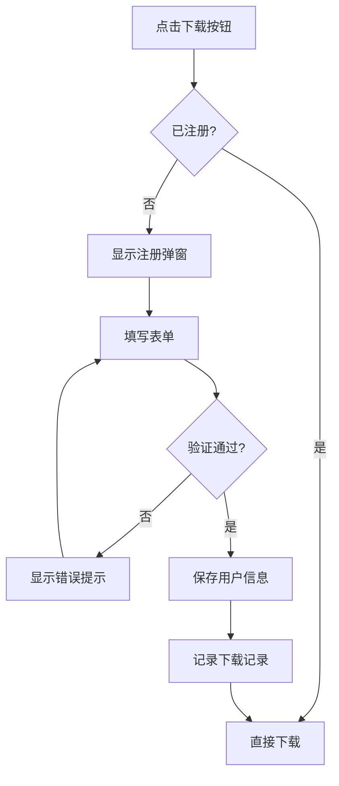

# 📥 资料下载与索取报价功能使用指南

**版本**: v1.0.0  
**日期**: 2025-12-21  
**功能分类**: 产品服务 / 用户注册 / 资料管理

---

## 🎯 功能概述

为企业外网用户提供产品资料下载和索取报价功能，包含：

1. **资料下载中心**：按产品分类展示手册、技术资料、白皮书
2. **用户注册系统**：姓名、公司、电话、邮箱、人机验证
3. **索取报价功能**：顶部导航快速入口
4. **后台管理系统**：资料上传、分类管理、统计分析

---

## 📱 前台功能使用

### 1️⃣ 资料下载中心

#### 访问路径
**首页** → **资料下载模块**（位于明星产品和服务网络之间）

#### 功能特性

```
📁 6大产品分类
├─ 🔧 拧紧工具（扭矩扳手、电动工具等）
├─ 🎯 套筒选型（抗振套筒、标准套筒等）
├─ 📊 数据采集（ToolsNet系统、曲线分析等）
├─ 💼 AICRM系统（客户管理、销售预测等）
├─ 🏭 智能制造（工作流、设备管理等）
└─ 🌐 国际营销（多语言EDM、线索孵化等）

🔍 实时搜索：输入关键词快速查找
📥 一键下载：注册后即可下载
📊 资料统计：自动记录下载量
```

#### 使用步骤

**第一步：选择产品分类**

```vue
<!-- 点击分类标签切换 -->
<el-tabs v-model="activeCategory">
  <el-tab-pane label="🔧 拧紧工具" name="tightening"></el-tab-pane>
  <el-tab-pane label="🎯 套筒选型" name="socket"></el-tab-pane>
  <!-- ... 更多分类 -->
</el-tabs>
```

**第二步：搜索资料（可选）**

```javascript
// 支持模糊搜索
searchKeyword.value = '扭矩扳手' // 自动过滤匹配资料
```

**第三步：点击下载按钮**

```vue
<!-- 点击后弹出注册对话框 -->
<el-button type="primary" @click="handleDownload(material)">
  <el-icon><Download /></el-icon>
  下载资料
</el-button>
```

---

### 2️⃣ 用户注册系统

#### 注册表单字段

| 字段 | 类型 | 验证规则 | 示例 |
|------|------|---------|------|
| **姓名** | 文本 | 2-20字符 | 张三 |
| **公司名称** | 文本 | 必填 | 某某制造有限公司 |
| **手机号** | 文本 | 11位数字 | 13800138000 |
| **邮箱** | Email | 标准格式 | zhang@company.com |
| **验证码** | 文本 | 4位字符 | aB3x（区分大小写） |

#### 验证码机制

```javascript
// Canvas动态生成验证码
const generateCaptcha = () => {
  const chars = 'ABCDEFGHJKMNPQRSTWXYZabcdefhijkmnprstwxyz23456789'
  captchaText.value = Array.from({ length: 4 }, 
    () => chars[Math.floor(Math.random() * chars.length)]
  ).join('')
  
  // 绘制验证码（含干扰线和噪点）
  drawCaptcha()
}

// 验证逻辑
const validateCaptcha = (rule, value, callback) => {
  if (value.toLowerCase() !== captchaText.value.toLowerCase()) {
    callback(new Error('验证码错误，请重新输入'))
  } else {
    callback()
  }
}
```

#### 注册流程



#### 数据存储

```javascript
// 用户信息存储
materialStore.registerUser({
  id: `user_${Date.now()}`,
  name: form.name,
  company: form.company,
  phone: form.phone,
  email: form.email,
  registeredAt: new Date().toISOString()
})

// 下载记录
materialStore.recordDownload({
  userId: currentUser.id,
  materialId: material.id,
  downloadedAt: new Date().toISOString()
})
```

---

### 3️⃣ 索取报价功能

#### 访问入口

**顶部导航栏** → **索取报价按钮**（蓝色突出显示）

```vue
<el-button type="primary" class="quote-btn" @click="showQuoteDialog">
  <el-icon><ChatDotRound /></el-icon>
  索取报价
</el-button>
```

#### 报价表单

| 字段 | 类型 | 说明 |
|------|------|------|
| **姓名** | 文本 | 联系人姓名 |
| **公司** | 文本 | 公司全称 |
| **手机** | 文本 | 联系电话 |
| **邮箱** | Email | 接收报价邮箱 |
| **产品类别** | 下拉 | 6大分类可选 |
| **需求描述** | 文本域 | 详细说明需求 |
| **验证码** | 文本 | 人机验证 |

#### 提交逻辑

```javascript
const submitQuoteRequest = async () => {
  // 1. 验证表单
  await quoteFormRef.value.validate()
  
  // 2. 保存报价请求
  materialStore.addQuoteRequest({
    id: `quote_${Date.now()}`,
    ...quoteForm,
    status: 'pending',
    createdAt: new Date().toISOString()
  })
  
  // 3. 提示成功
  ElMessage.success('报价请求已提交，我们将在24小时内联系您')
  
  // 4. 重置表单
  quoteFormRef.value.resetFields()
  showQuoteDialog.value = false
}
```

---

## 🖥️ 后台管理使用

### 访问路径

**后台首页** → **资料下载管理** → `http://localhost:3002/admin/material-download`

### 4️⃣ 资料管理（Tab 1）

#### 添加资料

**步骤：**

1. 点击右上角"添加资料"按钮
2. 填写资料信息：

```javascript
{
  title: '扭矩扳手产品手册',      // 资料标题
  category: 'tightening',        // 所属分类
  type: 'pdf',                   // 文件类型
  fileUrl: '/files/manual.pdf',  // 文件路径
  fileSize: '2.5MB',             // 文件大小
  description: '详细介绍...',    // 资料描述
  tags: ['扭矩扳手', '产品手册'] // 标签（便于搜索）
}
```

3. 上传文件（支持PDF/Excel）
4. 点击"确定"保存

#### 文件上传

```vue
<el-upload
  :action="`${apiBaseUrl}/upload/material`"
  :headers="{ Authorization: `Bearer ${adminToken}` }"
  :on-success="handleUploadSuccess"
  :limit="1"
  accept=".pdf,.xlsx,.xls">
  <el-button type="primary">
    <el-icon><UploadFilled /></el-icon>
    上传文件
  </el-button>
</el-upload>
```

#### 编辑资料

- 点击操作列的"编辑"按钮
- 修改资料信息
- 可重新上传文件
- 保存更新

#### 删除资料

- 点击"删除"按钮
- 确认后删除（注意：文件不会自动删除，需手动清理服务器）

---

### 5️⃣ 分类管理（Tab 2）

#### 默认分类

```javascript
const categories = [
  { id: 'tightening', name: '🔧 拧紧工具', icon: 'Tools' },
  { id: 'socket', name: '🎯 套筒选型', icon: 'Box' },
  { id: 'data-collection', name: '📊 数据采集', icon: 'DataAnalysis' },
  { id: 'aicrm', name: '💼 AICRM系统', icon: 'User' },
  { id: 'manufacturing', name: '🏭 智能制造', icon: 'Operation' },
  { id: 'marketing', name: '🌐 国际营销', icon: 'TrendCharts' }
]
```

#### 添加分类

1. 点击"添加分类"
2. 填写分类信息：
   - 分类ID（唯一标识）
   - 分类名称
   - 图标（Element Plus图标）
3. 保存

#### 编辑/删除分类

- 支持修改分类名称和图标
- 删除分类前需确保该分类下无资料

---

### 6️⃣ 下载统计（Tab 3）

#### 统计维度

```javascript
// 资料下载排行
const topMaterials = computed(() => {
  return materials.value
    .map(m => ({
      ...m,
      downloads: downloadRecords.value.filter(r => r.materialId === m.id).length
    }))
    .sort((a, b) => b.downloads - a.downloads)
    .slice(0, 10)
})

// 用户下载记录
const userDownloads = computed(() => {
  return users.value.map(u => ({
    ...u,
    downloadCount: downloadRecords.value.filter(r => r.userId === u.id).length
  }))
})
```

#### 统计图表

```vue
<el-card>
  <h3>📊 下载趋势</h3>
  <div ref="chartRef" style="height: 300px"></div>
</el-card>

<el-table :data="topMaterials">
  <el-table-column label="资料名称" prop="title" />
  <el-table-column label="下载次数" prop="downloads" sortable />
  <el-table-column label="分类" prop="category" />
</el-table>
```

---

### 7️⃣ 报价请求管理（Tab 4）

#### 请求列表

| 字段 | 说明 |
|------|------|
| **客户信息** | 姓名、公司、电话、邮箱 |
| **产品类别** | 请求报价的产品分类 |
| **需求描述** | 详细需求说明 |
| **状态** | pending（待处理）/ processing（处理中）/ completed（已完成） |
| **创建时间** | 请求提交时间 |

#### 处理流程

```javascript
// 更新状态
const updateQuoteStatus = (id, status) => {
  materialStore.updateQuoteRequest(id, { status })
  
  const statusText = {
    pending: '待处理',
    processing: '处理中',
    completed: '已完成'
  }
  ElMessage.success(`状态已更新为：${statusText[status]}`)
}

// 删除请求
const deleteQuoteRequest = (id) => {
  ElMessageBox.confirm('确定删除此报价请求吗？', '确认', {
    type: 'warning'
  }).then(() => {
    materialStore.deleteQuoteRequest(id)
    ElMessage.success('删除成功')
  })
}
```

---

## 📊 数据结构

### 资料数据（Material）

```typescript
interface Material {
  id: string              // 唯一标识
  title: string          // 资料标题
  category: string       // 所属分类
  type: 'pdf' | 'excel'  // 文件类型
  fileUrl: string        // 文件路径
  fileSize: string       // 文件大小
  description: string    // 资料描述
  tags: string[]         // 标签
  createdAt: string      // 创建时间
}
```

### 用户数据（User）

```typescript
interface User {
  id: string         // 用户ID
  name: string       // 姓名
  company: string    // 公司
  phone: string      // 手机
  email: string      // 邮箱
  registeredAt: string  // 注册时间
}
```

### 下载记录（DownloadRecord）

```typescript
interface DownloadRecord {
  id: string          // 记录ID
  userId: string      // 用户ID
  materialId: string  // 资料ID
  downloadedAt: string  // 下载时间
}
```

### 报价请求（QuoteRequest）

```typescript
interface QuoteRequest {
  id: string           // 请求ID
  name: string         // 姓名
  company: string      // 公司
  phone: string        // 手机
  email: string        // 邮箱
  product: string      // 产品类别
  requirements: string // 需求描述
  status: 'pending' | 'processing' | 'completed'  // 状态
  createdAt: string    // 创建时间
}
```

---

## 🔒 权限控制

### 前台

```javascript
// 下载资料前检查是否已注册
const handleDownload = (material) => {
  const currentUser = materialStore.currentUser
  
  if (!currentUser) {
    // 未注册，显示注册弹窗
    showRegisterDialog.value = true
    selectedMaterial.value = material
  } else {
    // 已注册，直接下载
    downloadMaterial(material)
  }
}
```

### 后台

```javascript
// 路由守卫
router.beforeEach((to, from, next) => {
  if (to.path.startsWith('/admin') && to.path !== '/admin/login') {
    const token = localStorage.getItem('adminToken')
    if (!token) {
      next('/admin/login')
    } else {
      next()
    }
  } else {
    next()
  }
})
```

---

## 🎨 UI/UX优化

### 响应式设计

```scss
.materials-grid {
  display: grid;
  grid-template-columns: repeat(auto-fill, minmax(300px, 1fr));
  gap: 20px;
  
  @media (max-width: 768px) {
    grid-template-columns: 1fr;
  }
}
```

### 加载状态

```vue
<el-button 
  :loading="downloading" 
  @click="handleDownload">
  {{ downloading ? '下载中...' : '下载资料' }}
</el-button>
```

### 空状态处理

```vue
<el-empty 
  v-if="filteredMaterials.length === 0"
  description="暂无相关资料" />
```

---

## 🧪 测试清单

### 前台测试

- [ ] 资料分类切换正常
- [ ] 搜索功能准确
- [ ] 下载按钮响应
- [ ] 注册表单验证完整
- [ ] 验证码显示和验证正确
- [ ] 注册成功后可直接下载
- [ ] 索取报价弹窗正常
- [ ] 报价表单提交成功

### 后台测试

- [ ] 资料添加成功
- [ ] 文件上传正常
- [ ] 资料编辑更新成功
- [ ] 资料删除确认
- [ ] 分类管理正常
- [ ] 下载统计准确
- [ ] 报价请求列表显示
- [ ] 状态更新正常

### 数据持久化

- [ ] localStorage保存用户信息
- [ ] 刷新页面数据保留
- [ ] 下载记录正确统计

---

## 🚀 快速开始

### 启动测试

```batch
# 运行测试脚本
🚀_测试资料下载与索取报价_2025-12-21.bat
```

### 访问地址

- **前台首页**: http://localhost:3002
- **后台管理**: http://localhost:3002/admin/material-download
- **登录页面**: http://localhost:3002/admin/login

---

## 📞 技术支持

如有问题，请联系开发团队：

- 📧 Email: dev@company.com
- 📱 微信: DevSupport
- 🌐 文档: http://docs.company.com

---

**文档版本**: v1.0.0  
**更新日期**: 2025-12-21  
**维护人员**: AI Development Team
